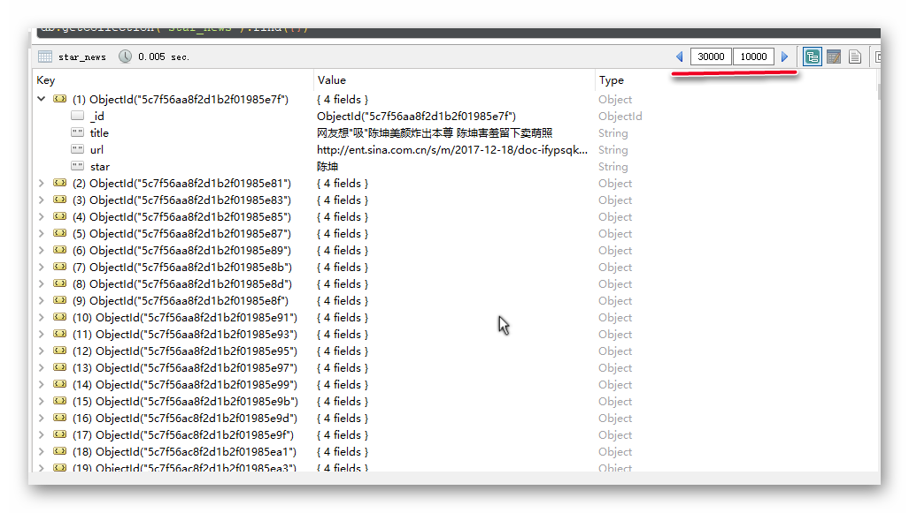
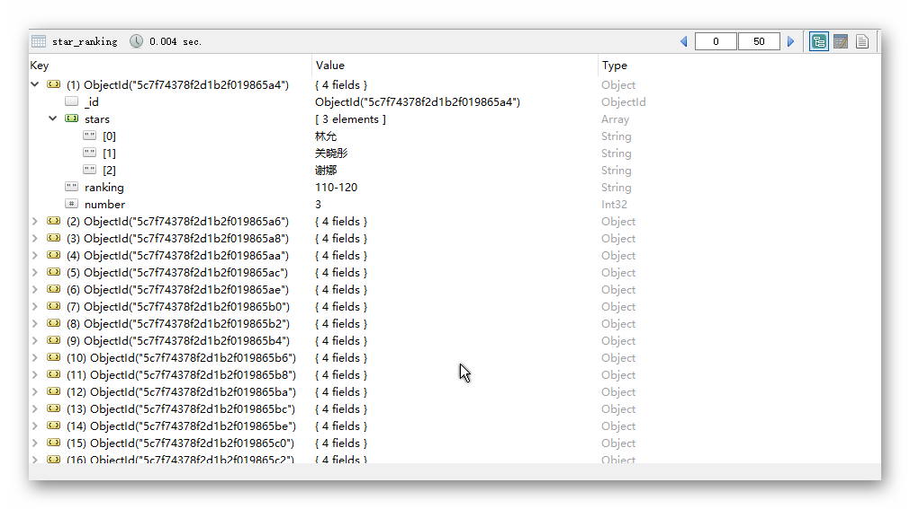
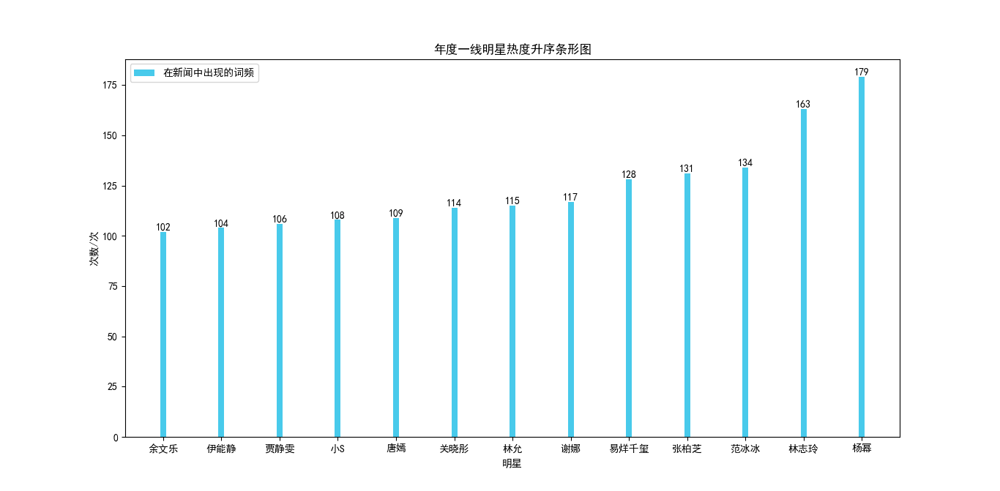
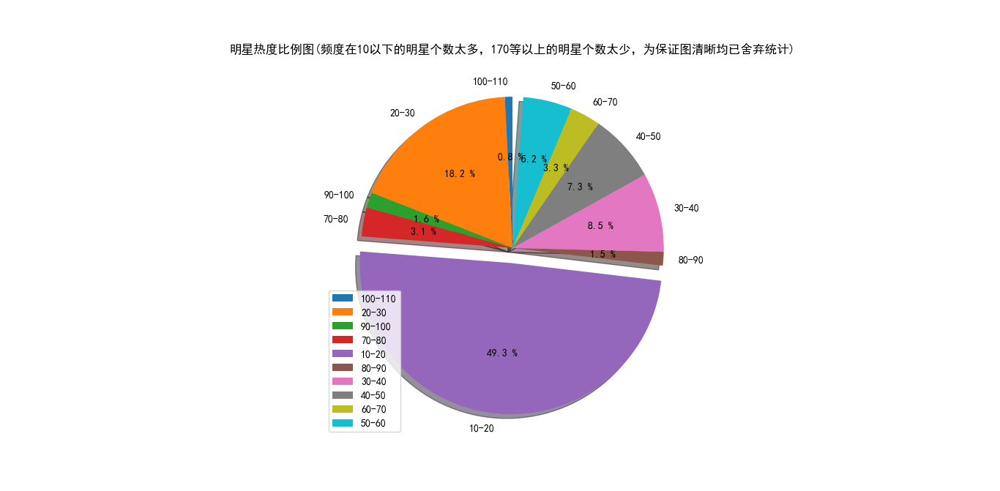

  </a>
  </a>
  </a>
  </a>

# 项目简介

新浪新闻明星板块爬虫,透过几万条数据看谁是年度最火明星。

# 运行示意

保存下来的 30000 条数据（数据是从某一天截至至代码运行的那一天，这个某一天可以是代码运行的那一天的前任意天）

分析明星热度，将明星分级，并将分级结果保存至数据库

将热度大于 100 的明星热度数据可视化

热门明星高频词生成的词云图限于篇幅，仅放出热度最高的（杨幂）

  </a>

# 作者简介

|作者|[inspurer](https://inspurer.github.io/2018/06/07/%E6%9C%88%E5%B0%8F%E6%B0%B4%E9%95%BF%E7%9A%84%E7%94%B1%E6%9D%A5/#more)|
|:---:|:---:|
|QQ交流群|[861016679](https://jq.qq.com/?_wv=1027&k=5Js6sKS)|
|个人博客|[https://inspurer.github.io/](https://inspurer.github.io/)|

更多精彩请关注公众号，微信扫描下方二维码或者在微信内搜索 **微信公众号：月小水长（ID:inspurer)**；

  </a>

